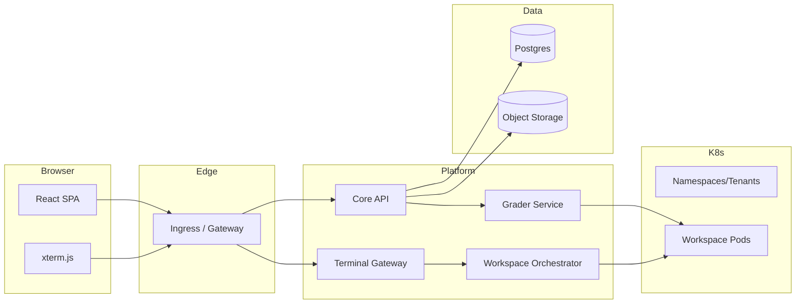

# Architektur

```mermaid
flowchart LR
  subgraph Browser
    UI[React SPA]
    TERM[xterm.js]
  end
  subgraph Edge
    INGRESS[Ingress / Gateway]
  end
  subgraph Platform
    API[Core API]
    WS[Terminal Gateway]
    ORCH[Workspace Orchestrator]
    GRADER[Grader Service]
  end
  subgraph Data
    PG[(Postgres)]
    S3[(Object Storage)]
  end
  subgraph K8s
    NS[Namespaces/Tenants]
    POD[Workspace Pods]
  end
  UI --> INGRESS --> API
  TERM --> INGRESS --> WS --> ORCH --> POD
  API --> PG
  API --> S3
  API --> GRADER --> POD
```

## Alternativen
- MicroVM/Kata: stärkere Isolation, höherer Overhead.
- Rootless single-host: leichter lokal, schwächere Isolation.
